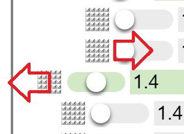
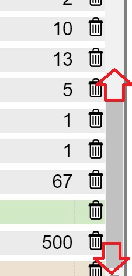
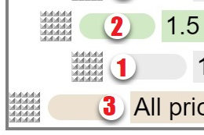
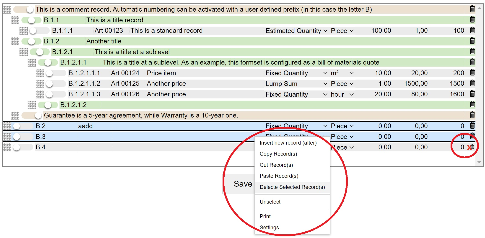

# ShoveboxList

## History
The shoveboxlist is a hierarchical list widget  that combines the table and the tree views. It was published by Mark Libbrecht in the April 2001 edition of Foxtalk Magazine, entitled "You Can Push it Around in Your...ShoveBoxList". 
   
The idea came from the stay alive board game from Milton Bradley (1971):    
  

## Behaviour and Characteristiques
 

  

  

  

  

  

  

