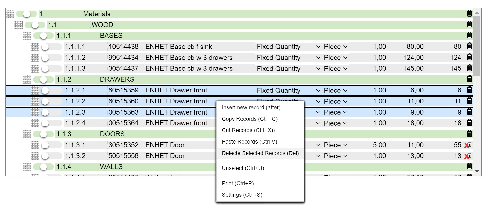

# ShoveboxList

## History
The shoveboxlist is a hierarchical list widget  that combines the table and the tree widgets. 
It was published by Mark Libbrecht in the April 2001 edition of Foxtalk Magazine, entitled "You Can Push it Around in Your...ShoveBoxList". 
 
An exemple of the 2001 shoveboxlist is depicted below   
  
For the record: the 'aha' moment for creating the shoveboxlist came up when playing the 'stay alive' board game  ( from Milton Bradley - 1971):    
  

# Behaviour and Characteristics

## General Overview

  
An example of the current appearance of the widget is shown in the screenshot below. This demonstration formset represents a fictious quote for a kitchen. 
The widget itself uses only HTML, CSS and plain vanilla javascript. Html rendering and data persitantence, in this demo to a SQLite database, is done through a django app  ( django-listbox).  
  
  

## Scrolling

   For vertical scrolling a traditional vertical scrollbar ('elevator' ) is available.   
  
  
  

## Record types and their representation

   Aside from the actual data, reports are typically broken down into different sections with corresponding headers to enhance human readibility. In order to treat section headers as well as other explanatory texts and comments in the same data tables and lists as the actual data and represent them , a tri-state button is available to determine the type of the record. .   
  

  
  

## Context menu 

  
  

## Ordering, Drag and drop

  
  

## Shrinkable field

### Reason for a shrinkable field 

No horizontal scrolling 

### Different list width examples

  
  
  
  

### Tooltip for shrinkable field
  
  

### Popup editing window of a record

  
  

  
  

## Levels concept

  
  

## Changing Levels, 'Shoving'

 
  

## Automatic numbering

  