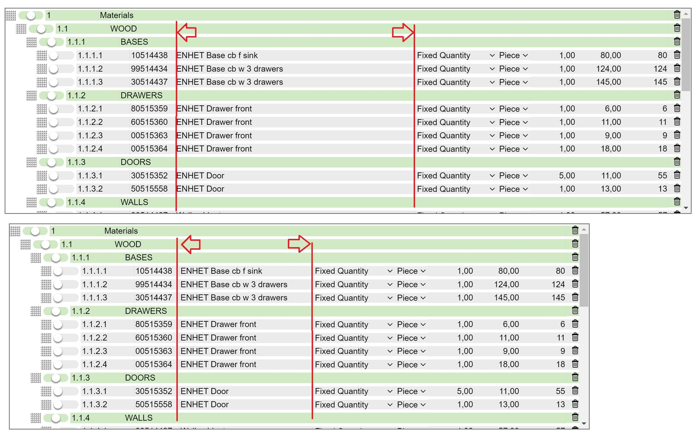
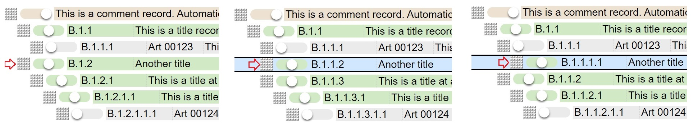
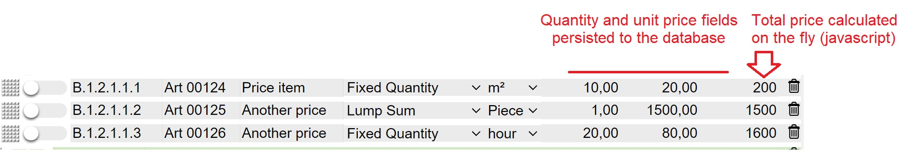

# ShoveboxList

## History
The shoveboxlist is a hierarchical list widget  that combines the table and the tree widgets. 
It was published by Mark Libbrecht in the April 2001 edition of Foxtalk Magazine, entitled "You Can Push it Around in Your...ShoveBoxList". 
 
Screenshot from the 2001 shoveboxlist article:  
 
For the record: the 'aha' moment for creating the shoveboxlist came up when playing the 'stay alive' board game  ( from Milton Bradley - 1971):   
 

# Behavior and Characteristics

## General Overview

 
An example of the current appearance of the widget is shown in the screenshot below. This demonstration formset represents a fictious quote for a kitchen. 
The widget itself uses only HTML, CSS and plain vanilla javascript (no javascript library whatsoever). Html rendering and data persitantence, in this demo to a SQLite database, is done through a django app  ( django-listbox).  
  
 

## Scrolling

 As far as scrolling to the records is concerned, the shoveboxlist behaves like a tradional list. For vertical scrolling a traditional vertical scrollbar ('elevator' ) is available.   
 
 
 

## Record types and their representation

  Aside from the actual data, reports are typically broken down into different sections with corresponding headers to enhance human readibility. In order to treat section headers as well as other explanatory texts and comments in the same data tables and lists as the actual data and represent them , a multi-state button is available to determine the type of the record. In the demo a tri-state switch is used for switching between a normal price item reord, a title record and a comment record. For enhancing readibility, only certain applicable fields stay visible depending on their status and a color is associated with the status. In this case grey for normal price item (1), green for a title (2) and red for a comment record (3). PS: Selected records are in blue.
 

 
 

## Context menu 

 
An intuitive, configurable context menu (mturco), acivated by right clicking in the shoveboxlist, gives access to some group operations. Selecting records is ackomplished by holding the Ctrl key and clicking the applicable records. Selected records return blue.
- insert new record (after)
- copy selected records (to clipboard)
- cut Records  (to clipboard)
- paste Records (from clipboard)
- delete selected records
- unselect previously selected records
- print function giving access to reporting
- settings 

 

 

## Ordering, Drag and drop

 
Apart from cutting and pasting and inserting records at particular places, records can also be moved vertically by [dragging and dropping](https://en.wikipedia.org/wiki/Drag_and_drop) them:
 

 
 

## Shrinkable field

### Reason for a shrinkable field 

 
Given the design objective of showing all information without the need of horizontal scrolling, changing total width of the shoveboxlist goes at the expense of of shrinkable field. This is in most cases the most verbose field, in this case the price item description field.
 

 
 

### Tooltip for shrinkable field

 
Since it can happen that the text in the shrinkable field is too long to fit into the available space, the content can be visualised by hoovering over the field causing a tooltip to show up.
 

 
 

## Popup editing window of a record
 

For convenient editing of a record and an alternative to using, double-clicking on a record triggers an editing window to pop up.
 
Chrome
 
 
Firefox
 
 

## Levels concept

Conventional tables and lists lack the hierarchy concept that tree widgets do have. The shoveboxlist introduces hierarchy through by a number of predetermined horizontal positions a record can occupy.   This is represented graphically by a square 'grip' user interface that acts as a handle to enable horizontal movement. In the demo, 7 possible levels are configured:

 
 

Clicking and holding the grip and subsequently shoving ( = level change ) gives the list its name.

 
 

# Additional features

## Automatic numbering

Depending on the use case, additional features can be introduced. In the demo, an automatic hierarchical item numbering is introduced.

 

## Automatic calculation
 
The demo also showcases an automatic calculation for numerical fields. In this case it is the : quantity times unit price = total calculation. It is implement by means of the django-calculation app  (Blas Isaias Fernández)

 

 